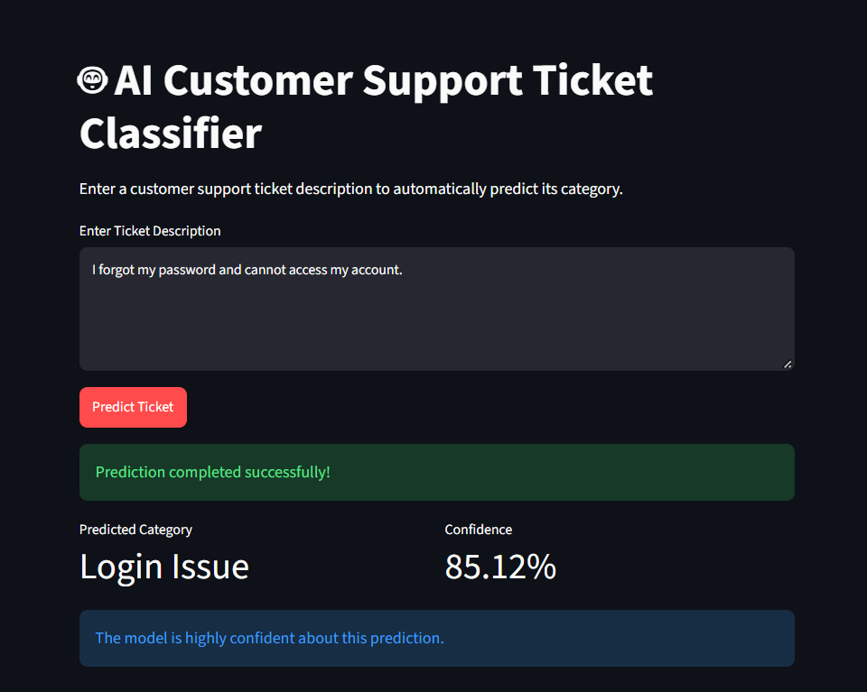

# AI Customer Support Ticket Classifier

A lightweight machine learning project that predicts the category of a customer support ticket from its text description.

## Overview

This project trains a text classification model on a small custom dataset of customer support tickets. It uses TF-IDF feature extraction with a Logistic Regression classifier to classify incoming tickets into predefined categories.

The system includes:

- data generation and preprocessing
- exploratory data analysis
- model training and evaluation
- command-line prediction
- a Streamlit web app for interactive use

## Problem Statement

Support teams often receive a large number of service requests every day. Manually sorting each ticket into the correct category takes time and can lead to delays.

This project aims to automate that process by predicting the appropriate ticket category using only the ticket text.

Supported categories:

- Login Issue
- Application Error
- Report
- Account Update
- Performance

## Tech Stack

- Python
- Pandas
- NumPy
- Matplotlib
- Seaborn
- Scikit-learn
- Joblib
- Streamlit

## Dataset

The project uses a custom-created dataset with 225 records, evenly distributed across five categories.

Columns:

- `ticket_id`
- `ticket_description`
- `category`
- `priority`
- `status`

The dataset is generated using `src/create_dataset.py`.

## Model Workflow

```text
Ticket text
   ↓
Text cleaning and preprocessing
   ↓
TF-IDF vectorization
   ↓
Logistic Regression classifier
   ↓
Predicted category + confidence score
```

## Project Structure

```text
AI_Assingment_Suvadip_Khanra/
├── data/
│   └── tickets.csv
├── src/
│   ├── create_dataset.py
│   ├── preprocessing.py
│   ├── train.py
│   ├── predict.py
│   └── app.py
├── model/
│   ├── ticket_classifier.pkl
│   └── tfidf_vectorizer.pkl
├── outputs/
│   ├── category_distribution.png
│   ├── priority_distribution.png
│   └── confusion_matrix.png
├── screenshots/
│   ├── dataset.png
│   ├── analysis.png
│   ├── confusion_matrix.png
│   └── prediction.png
├── requirements.txt
├── README.md
└── .gitignore
```

## Installation

### 1. Clone or extract the project

Open a terminal in the project root folder.

### 2. Create a virtual environment

On Windows:

```bash
python -m venv .venv
.venv\Scripts\activate
```

### 3. Install dependencies

```bash
python -m pip install -r requirements.txt
```

## How to Run

### Generate the dataset

```bash
python src/create_dataset.py
```

### Run preprocessing and EDA

```bash
python src/preprocessing.py
```

### Train the model

```bash
python src/train.py
```

### Run command-line prediction

```bash
python src/predict.py
```

### Run the Streamlit app

```bash
python -m streamlit run src/app.py
```

The app runs locally at:

```text
http://localhost:8501
```

## Model Result

The current model achieved strong performance on the test split:

| Metric | Score |
|--------|------:|
| Accuracy | 100.00% |
| Precision | 100.00% |
| Recall | 100.00% |
| F1 Score | 100.00% |

This is a custom assignment dataset, so the result is useful for demonstrating the workflow, but it should not be treated as production-level validation.

## Example Prediction

Input:

```text
I forgot my password and cannot login
```

Output:

```text
Predicted Category: Login Issue
Confidence: 85.12%
```

## Screenshot




## Author

Suvadip Khanra


